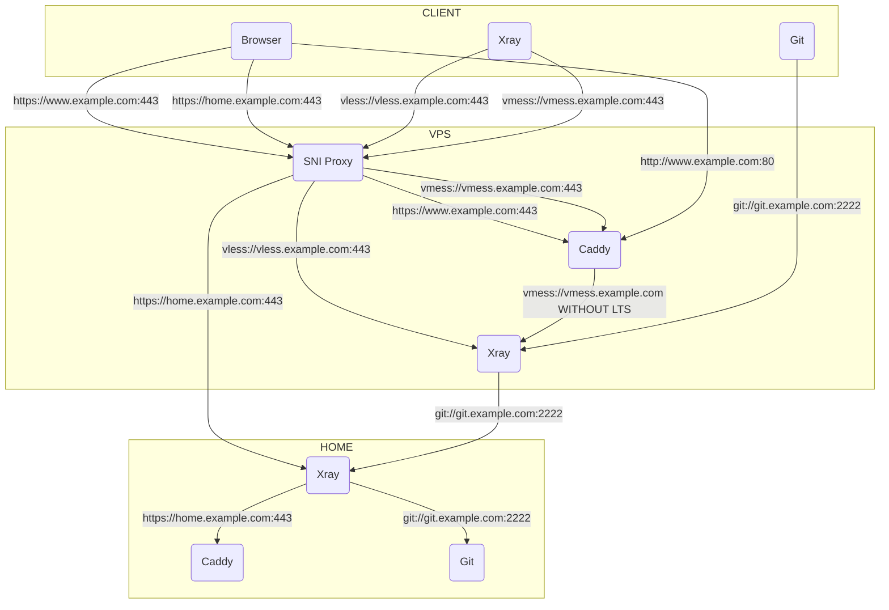

## 前言

由于条件所限，我在住所使用了一台 AMD 小主机运行了 PVE，上面跑了许多服务，他们有一个共同点——具有 Web UI。另一方面，我的宽带使用共享公网 IP，使用 Full Cone NAT，这就导致我在外难以方便地访问内网服务。为了解决这个令人不爽的问题，我准备使用 VPS 主机作为中间人，用于反射相关流量。

比较悲剧的是，在撰写本文时，VPS 的 443 端口被干掉……不过还好，VPS 即将到期，如果不能恢复，就换别的了。

## 网络拓扑图

简单画一下，大概网络拓扑长下面这样：



从上图中可以看到，VPS 公网 443 端口由 SNI Proxy 监听，80 端口由 Caddy 监听，2222 端口作为 家庭 Git 服务器的透传端口，由 Xray 直接监听并反射（relay）给家庭 Git 服务。

SNI Proxy 通过对 TLS 的 SNI 对流量进行区分，将访问部署在家庭中的网站的流量直接转发给 Xray，再由 Xray 根据规则转发给家庭中的 Caddy 服务，最后由家庭中的 Caddy 服务将 HTTPS 流量转为 HTTP 流量，并转发给目标服务。对于 VLESS 流量，将转发给 Xray 对应端口处理；对于 vmess 和其他网站流量，转发给 Caddy 的 443 端口处理。

Caddy 接收到 443 端口的流量，将根据域名等规则处理并转发给对应服务，如果是 vmess 流量，将扒掉 TLS 层并交由 Xray 处理。Caddy 还接收 80 端口的流量，这部分流量基本上都转发给对应 HTTP 服务进行处理。

## 部署

### Docker Compose

```yml
version: '3.9'

networks:
  caddy:
  xray:

volumes:
  caddy-data:
  caddy-config:
  acme-sh-data:

services:
  xray:
    image: teddysun/xray
    container_name: xray
    restart: always
    ports:
      - '2222:2222'
    networks:
      - xray
    volumes:
      - ./xray/config.yml:/etc/xray/config.yml
      - acme-sh-data:/certs
    command: 'xray -c=/etc/xray/config.yml'

  caddy:
    image: caddy:2
    container_name: caddy
    restart: always
    ports:
      - '80:80'
    networks:
      - caddy
      - xray
    volumes:
      - $PWD/caddy/Caddyfile:/etc/caddy/Caddyfile
      - $PWD/site:/srv
      - caddy-data:/data
      - caddy-config:/config
      - acme-sh-data:/certs

  sniproxy:
    image: tommylau/sniproxy
    container_name: sniproxy
    restart: always
    networks:
      - caddy
      - xray
    ports:
      - '443:443'
    volumes:
      - $PWD/sniproxy:/etc/sniproxy
      - /var/log/sniproxy:/var/log/sniproxy
  acme.sh:
    image: neilpang/acme.sh:dev
    container_name: acme.sh
    restart: always
    volumes:
      - acme-sh-data:/acme.sh
    env_file: acme.env
    command: 'daemon'
```

### SNI Proxy 配置

文件位于 `sniproxy/sniproxy.conf

```conf
user nobody
group nogroup

# PID file
pidfile /var/run/sniproxy.pid

error_log {
    # Log to the daemon syslog facility
    # syslog deamon

    # Alternatively we could log to file
    filename /var/log/sniproxy/sniproxy.log

    # Control the verbosity of the log
    priority notice
}

listen 443 {
    proto tls
    table https_hosts

    access_log {
        filename /var/log/sniproxy/https_access.log
        priority notice
    }
}

table https_hosts {
    vmess.example.com caddy:443 # vmess
    vless.example.com xray:443 # VLESS
    .*\.example\.com	xray:8443 # HTTPS tunnel
    www.example.com		caddy:443 # VPS vhost
}
```

### Caddy 配置

文件位于 `caddy/Caddyfile`。

```caddyfile
www.example.com {
  encode zstd gzip
  reverse_proxy some-host:80
}

vmess.example.com {
  reverse_proxy h2c://xray:80 // vmess
}
```

### Xray 配置

文件位于 `xray/config.yml`

```yml
---
inbounds:
  - tag: vless-xtls.in
    listen: 0.0.0.0
    port: 443
    protocol: vless
    settings:
      clients:
        - id: <your-uuid>
          flow: xtls-rprx-direct
      decryption: none
    streamSettings:
      network: tcp
      security: xtls
      xtlsSettings:
        serverName: vless.example.com
        alpn:
          - h2
          - http/1.1
        certificates:
          - certificateFile: /certs/*.example.com/fullchain.cer
            keyFile: /certs/*.example.com/*.example.com.key
    falklbacks:
      - name: 'vmess.ivanli.cc'
        dist: 80
        xver: 1
      - dest: 'caddy:80'
        xver: 1
  - listen: 0.0.0.0
    port: 80
    protocol: vmess
    settings:
      clients:
        - id: <your-uuid>
      decryption: none
    streamSettings:
      network: h2
      security: none
      httpSettings:
        path: /
        host:
          - vmess.example.com
  # ... 其他配置 ...
```

关于反向代理及泛域名证书相关配置，参考[使用 Xray、acme.sh、Docker Compose 搭建内网穿透服务](https://ivanli.cc/blog/build-an-frp-using-xray-acme.sh-docker-compose)。

### 启动服务

启动服务前，确保你的配置都完成了。之后在 `docker-compose.yml` 同级目录下执行下面的命令：

```bash
docker compose up -d
```

如果有防火墙，注意放行端口。

## 方案浅析

上述方案主要解决了一个问题，443 端口的复用。使得所有**“HTTPS 流量”**都流向 443 端口，显得非常治愈。因为使用了境外服务器，为了避免被误杀，实现了站点伪装，这样在一定程度上避免被主动探测发现问题。可是在撰写本文前，翻车了，原因可能是客户端指纹特征导致的。因为除了穿透服务的客户端是完全可控的，能通过配置[开启 uTLS 来规避](https://t.ivanli.cc/UFImlX)，但是在网关上的 Clash 客户端却没提供相关配置选项。大意了。
